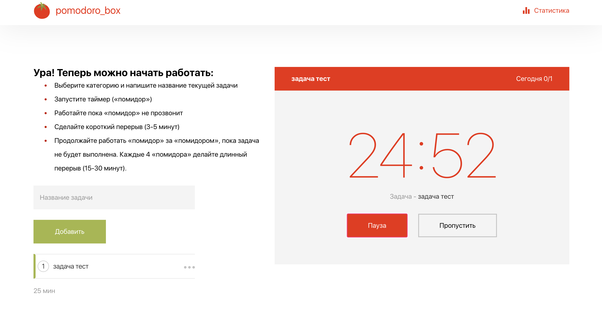
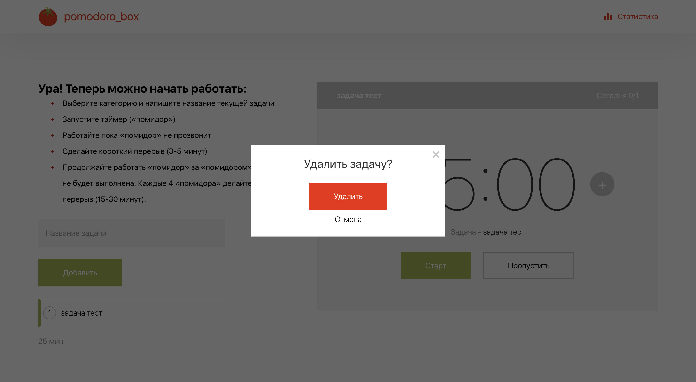

# Pomodoro - таск менеджер по технике pomodoro

Здесь можно:
- добавить задачу
- изменить задачу
- удалить задачу
- установить количество помидоров для каждой задачи
- запустить таймер
- менять активные задачи

# Демо 
[Pomodoro](https://tamaradzhahparova.github.io/pomodoro/)

## Screenshots

- Главный экран

- Таймер запущен

- Добавление и редактирование задач

- Удаление задачи

- Не выбрана активная задача

